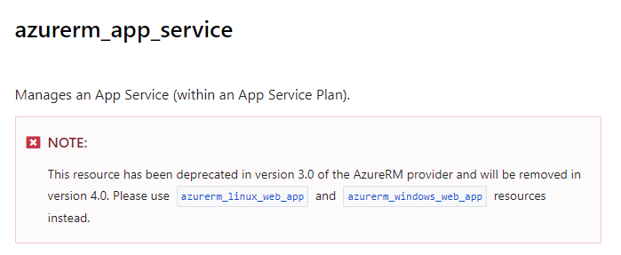

I was looking through the [Terraform Documentation for the AzureRM provider](https://registry.terraform.io/providers/hashicorp/azurerm/latest) the other day, and I came across an note on the azurerm_app_Service page.

[](https://registry.terraform.io/providers/hashicorp/azurerm/latest/docs/resources/app_service "azurerm_app_service deprecation note")

The following resources have been deprecated in version 3.0 and will be removed in version 4.0:

- [azurerm_app_service](https://registry.terraform.io/providers/hashicorp/azurerm/latest/docs/resources/app_service)
- [azurerm_function_app](https://registry.terraform.io/providers/hashicorp/azurerm/latest/docs/resources/function_app)
- [azurerm_app_service_plan](https://registry.terraform.io/providers/hashicorp/azurerm/latest/docs/resources/app_service_plan)

They are replaced by the following new resource types:

- [azurerm_linux_web_app](https://registry.terraform.io/providers/hashicorp/azurerm/latest/docs/resources/linux_web_app)
- [azurerm_windows_web_app](https://registry.terraform.io/providers/hashicorp/azurerm/latest/docs/resources/windows_web_app)
- [azurerm_linux_function_app](https://registry.terraform.io/providers/hashicorp/azurerm/latest/docs/resources/linux_function_app)
- [azurerm_windows_function_app](https://registry.terraform.io/providers/hashicorp/azurerm/latest/docs/resources/windows_function_app)
- [azurerm_service_plan](https://registry.terraform.io/providers/hashicorp/azurerm/latest/docs/resources/service_plan)


For more details on these changes, I put together a video where I explore some of the differences between the old and new resouces that I have noticed. Feel free to check it out.

[](https://www.youtube.com/watch?v=o5JUm4f-Ru4)


Here are a few key changes that I noticed so far, aside from the name changes:

- azurerm_service_plan
    - The Reserved attribute is no longer required to be set as **true** when **kind** is set to **linux**. The resource will automatically set this value if **os_type** equals **linux**;
    - SKU is set differently. Instead of specifying **tier** and **size** in the **sku** block, there is now an attribute called **sku_name**.
    - Also, instead of specifying a **capacity** in the **sku** block, the new resource uses the attribute **worker_count**
- azurerm_linux_web_app/azurerm_windows_web_app
    - **app_service_plan_id** is now called **service_plan_id**
    - **site_config** block is now required. If not using, just leave empty. (ex. site_config {})
    - New [**application_stack**](https://registry.terraform.io/providers/hashicorp/azurerm/latest/docs/resources/linux_web_app#application_stack) block under site_config. Container images are now defined here as well as things like dotnet_version
- azurerm_linux_function_app/azurerm_windows_function_app
    - **site_config** block is required here as well.
    - **storage_account_access_key** is now optional.

## Below, you can find some basic examples of the new and deprecated resources for comparison.

These working examples are also available on GitHub in my [AzureAppServiceChanges
](https://github.com/mmcelreath/AzureAppServiceChanges) Repository. 

You may just need to update the App Service Names since they need to be globally unique.

# Example: App Service Plan

## azurerm_app_service_plan (Deprecated)

```
resource "azurerm_app_service_plan" "asp_linux_old" {
  name                = "asp-linux-old"
  location            = azurerm_resource_group.rg_appservice_linux_old.location
  resource_group_name = azurerm_resource_group.rg_appservice_linux_old.name
  reserved            = true
  kind                = "linux"

  sku {
    tier     = "Basic"
    size     = "B1"
    capacity = 1
  }
}
```

## azurerm_linux_web_app

```
resource "azurerm_linux_web_app" "as_linux_new" {
  name                = "as-linux-new-01"
  location            = azurerm_resource_group.rg_appservice_linux_new.location
  resource_group_name = azurerm_resource_group.rg_appservice_linux_new.name
  service_plan_id     = azurerm_service_plan.asp_linux_new.id

  site_config {
    always_on = true
    
    application_stack {
      docker_image     = "appsvcsample/python-helloworld"
      docker_image_tag = "latest"
      dotnet_version   = "6.0"
    }
  }
}
```

# Example: Linux App

## azurerm_app_service (Deprecated)

```
resource "azurerm_resource_group" "rg_appservice_linux_old" {
  name     = "rg-appservice-linux-old"
  location = "Eastus2"
}

resource "azurerm_app_service_plan" "asp_linux_old" {
  name                = "asp-linux-old"
  location            = azurerm_resource_group.rg_appservice_linux_old.location
  resource_group_name = azurerm_resource_group.rg_appservice_linux_old.name
  reserved            = true
  kind                = "linux"

  sku {
    tier     = "Basic"
    size     = "B1"
    capacity = 1
  }
}

resource "azurerm_app_service" "as_linux_old" {
  name                = "as-linux-old-01"
  location            = azurerm_resource_group.rg_appservice_linux_old.location
  resource_group_name = azurerm_resource_group.rg_appservice_linux_old.name
  app_service_plan_id = azurerm_app_service_plan.asp_linux_old.id

  site_config {
    dotnet_framework_version = "v4.0"
    linux_fx_version         = "DOCKER|appsvcsample/python-helloworld:latest"

    always_on = true
  }
}
```

## azurerm_linux_web_app

```
resource "azurerm_resource_group" "rg_appservice_linux_new" {
  name     = "rg-appservice-linux-new"
  location = "Eastus2"
}

resource "azurerm_service_plan" "asp_linux_new" {
  name                = "asp-linux-new"
  resource_group_name = azurerm_resource_group.rg_appservice_linux_new.name
  location            = azurerm_resource_group.rg_appservice_linux_new.location
  # reserved            = true
  os_type      = "Linux"
  sku_name     = "B1"
  worker_count = 1
}

resource "azurerm_linux_web_app" "as_linux_new" {
  name                = "as-linux-new-01"
  location            = azurerm_resource_group.rg_appservice_linux_new.location
  resource_group_name = azurerm_resource_group.rg_appservice_linux_new.name
  service_plan_id     = azurerm_service_plan.asp_linux_new.id

  site_config {
    always_on = true
    
    application_stack {
      docker_image     = "appsvcsample/python-helloworld"
      docker_image_tag = "latest"
      dotnet_version   = "6.0"
    }
  }
}
```

# Example: Windows App

## azurerm_app_service (Deprecated)

```
resource "azurerm_resource_group" "rg_appservice_windows_old" {
  name     = "rg-appservice-windows-old"
  location = "Eastus2"
}

resource "azurerm_app_service_plan" "asp_windows_old" {
  name                = "asp-windows"
  location            = azurerm_resource_group.rg_appservice_windows_old.location
  resource_group_name = azurerm_resource_group.rg_appservice_windows_old.name
  kind                = "windows"

  sku {
    tier     = "Basic"
    size     = "B1"
    capacity = 1
  }
}

resource "azurerm_app_service" "as_windows_old" {
  name                = "as-windows-old"
  location            = azurerm_resource_group.rg_appservice_windows_old.location
  resource_group_name = azurerm_resource_group.rg_appservice_windows_old.name
  app_service_plan_id = azurerm_app_service_plan.asp_windows_old.id

  site_config {
    dotnet_framework_version = "v4.0"
    always_on = true
  }
}
```

## azurerm_windows_web_app

```
resource "azurerm_resource_group" "rg_appservice_windows_new" {
  name     = "new-rg-appservice-windows"
  location = "Eastus2"
}

resource "azurerm_service_plan" "asp_windows_new" {
  name                = "asp-windows-new"
  resource_group_name = azurerm_resource_group.rg_appservice_windows_new.name
  location            = azurerm_resource_group.rg_appservice_windows_new.location
  os_type             = "Windows"
  sku_name            = "B1"
  worker_count        = 1
}

resource "azurerm_windows_web_app" "as_windows_new" {
  name                = "as-windows-new-01"
  resource_group_name = azurerm_resource_group.rg_appservice_windows_new.name
  location            = azurerm_resource_group.rg_appservice_windows_new.location
  service_plan_id     = azurerm_service_plan.asp_windows_new.id

  site_config {
    always_on = true
    
    application_stack {
      dotnet_version = "v4.0"
    }
  }
}
```

# Example: Linux Function App

## azurerm_function_app (Deprecated)

```
resource "azurerm_resource_group" "rg_functionapp_linux_old" {
  name     = "rg-functionapp-linux-old"
  location = "Eastus2"
}

resource "azurerm_storage_account" "sa_old" {
  name                     = "safunclinold01"
  resource_group_name      = azurerm_resource_group.rg_functionapp_linux_old.name
  location                 = azurerm_resource_group.rg_functionapp_linux_old.location
  account_tier             = "Standard"
  account_replication_type = "LRS"
}

resource "azurerm_app_service_plan" "asp_functionapp_linux_old" {
  name                = "asp-functionapp-linux-old"
  location            = azurerm_resource_group.rg_functionapp_linux_old.location
  resource_group_name = azurerm_resource_group.rg_functionapp_linux_old.name
  reserved            = true
  kind                = "Linux"

  sku {
    tier = "Basic"
    size = "B1"
  }
}

resource "azurerm_function_app" "functionapp_linux_old" {
  name                       = "functionapp-linux-old-01"
  location                   = azurerm_resource_group.rg_functionapp_linux_old.location
  resource_group_name        = azurerm_resource_group.rg_functionapp_linux_old.name
  app_service_plan_id        = azurerm_app_service_plan.asp_functionapp_linux_old.id
  storage_account_name       = azurerm_storage_account.sa_old.name
  storage_account_access_key = azurerm_storage_account.sa_old.primary_access_key

  site_config {
    always_on = true
  }
}
```

## azurerm_linux_function_app

```
resource "azurerm_resource_group" "rg_functionapp_linux_new" {
  name     = "rg-functionapp-linux-new"
  location = "Eastus2"
}

resource "azurerm_storage_account" "sa_new" {
  name                     = "safunclinnew01"
  resource_group_name      = azurerm_resource_group.rg_functionapp_linux_new.name
  location                 = azurerm_resource_group.rg_functionapp_linux_new.location
  account_tier             = "Standard"
  account_replication_type = "LRS"
}

resource "azurerm_service_plan" "asp_functionapp_linux_new" {
  name                = "asp-functionapp-linux-new"
  resource_group_name = azurerm_resource_group.rg_functionapp_linux_new.name
  location            = azurerm_resource_group.rg_functionapp_linux_new.location
  # reserved            = true 
  os_type  = "Linux"
  sku_name = "B1"
}

resource "azurerm_linux_function_app" "functionapp_linux_new" {
  name                 = "functionapp-linux-new-01"
  location             = azurerm_resource_group.rg_functionapp_linux_new.location
  resource_group_name  = azurerm_resource_group.rg_functionapp_linux_new.name
  service_plan_id      = azurerm_service_plan.asp_functionapp_linux_new.id
  storage_account_name = azurerm_storage_account.sa_new.name

  # Optional
  # storage_account_access_key = azurerm_storage_account.sa_new.primary_access_key

  site_config {
    always_on = true
  }
}
```

# Example: Windows Function App

## azurerm_function_app (Deprecated)

```
resource "azurerm_resource_group" "rg_functionapp_windows_old" {
  name     = "rg-functionapp-windows-old"
  location = "Eastus2"
}

resource "azurerm_storage_account" "sa_old" {
  name                     = "safuncwinold01"
  resource_group_name      = azurerm_resource_group.rg_functionapp_windows_old.name
  location                 = azurerm_resource_group.rg_functionapp_windows_old.location
  account_tier             = "Standard"
  account_replication_type = "LRS"
}

resource "azurerm_app_service_plan" "asp_functionapp_windows_old" {
  name                = "asp-functionapp-windows-old"
  location            = azurerm_resource_group.rg_functionapp_windows_old.location
  resource_group_name = azurerm_resource_group.rg_functionapp_windows_old.name
  kind                = "Windows"

  sku {
    tier = "Basic"
    size = "B1"
  }
}

resource "azurerm_function_app" "functionapp_windows_old" {
  name                       = "functionapp-windows-old-01"
  location                   = azurerm_resource_group.rg_functionapp_windows_old.location
  resource_group_name        = azurerm_resource_group.rg_functionapp_windows_old.name
  app_service_plan_id        = azurerm_app_service_plan.asp_functionapp_windows_old.id
  storage_account_name       = azurerm_storage_account.sa_old.name
  storage_account_access_key = azurerm_storage_account.sa_old.primary_access_key
}
```

## azurerm_windows_function_app

```
resource "azurerm_resource_group" "rg_functionapp_windows_new" {
  name     = "rg-functionapp-windows-new"
  location = "Eastus2"
}

resource "azurerm_storage_account" "sa_new" {
  name                     = "safuncwinnew01"
  resource_group_name      = azurerm_resource_group.rg_functionapp_windows_new.name
  location                 = azurerm_resource_group.rg_functionapp_windows_new.location
  account_tier             = "Standard"
  account_replication_type = "LRS"
}

resource "azurerm_service_plan" "asp_functionapp_windows_new" {
  name                = "asp-functionapp-windows-new"
  resource_group_name = azurerm_resource_group.rg_functionapp_windows_new.name
  location            = azurerm_resource_group.rg_functionapp_windows_new.location
  os_type             = "Windows"
  sku_name            = "B1"
}

resource "azurerm_windows_function_app" "functionapp_windows_new" {
  name                 = "functionapp-windows-new-01"
  location             = azurerm_resource_group.rg_functionapp_windows_new.location
  resource_group_name  = azurerm_resource_group.rg_functionapp_windows_new.name
  service_plan_id      = azurerm_service_plan.asp_functionapp_windows_new.id
  storage_account_name = azurerm_storage_account.sa_new.name

  # Optional
  # storage_account_access_key = azurerm_storage_account.sa_new.primary_access_key

  # Required
  site_config {}
}
```