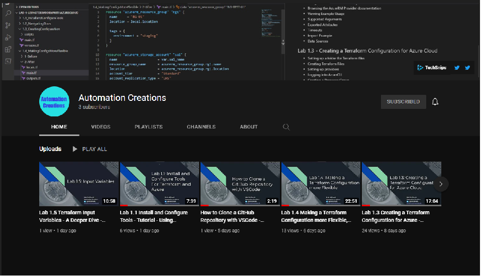
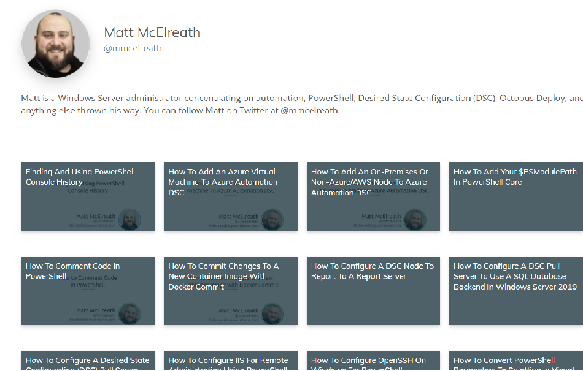

# Welcome

Welcome. This space will be focusing on topics such as Automation, PowerShell, Azure, AWS, Terraform and more. 

# YouTube Channel

Currently, you can check out my YouTube channel for an introductory lab on using Terraform with Microsoft Azure. It's geared towards beginners that may know a little about each technology but haven't fully jumped in.

[https://www.youtube.com/channel/UCBmvsfL6OKpUBfLArIskOcA](https://www.youtube.com/channel/UCBmvsfL6OKpUBfLArIskOcA)

# TechSnips

I did some videos for [TechSnips.com](https://techsnips.io/contributors/matt-mcelreath/) a few years ago, covering the following topics as well:

- Docker
- Desired State Configuration (DSC)
- PowerShell
- AWS Lambda
- Amazon Simple Email Service (SES)
- Azure Storage Accounts
- OpenSSH on Windows

I'd love to hear suggestions for content you'd like to see here or on the YouTube Channel so feel free to reach out on twitter. [@mmcelreath](https://twitter.com/Mmcelreath)